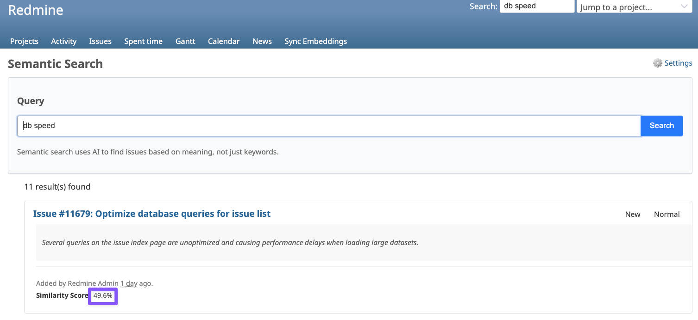

# Setup Guide

This Guide will give you a step-by-step Tutorial on how to set this Plugin up.

## Pre-requisites

Before we get started, make sure you have the following done already.

✅ Optional: Your OpenAI API Key. Get it [here](https://platform.openai.com/api-keys).
<br />
✅ A valid Redmine 5.1 or 6.0 instance (see [Setting Up Redmine](#setting-up-redmine))

# Plugin Setup

First, clone the plugin repository into the `plugins` directory of your Redmine instance.
It's assumed you are in your Redmine root directory when you run the following command:

```bash
git clone https://github.com/renuo/redmine_semantic_search plugins/redmine_semantic_search
```

Next, install the required system-wide dependencies (this will install both `postgresql` and `pgvector` if you don't have them):

```bash
brew install postgresql@16 pgvector
```

Then, navigate into the newly cloned plugin's directory and install its specific Ruby dependencies using Bundler:

```bash
cd plugins/redmine_semantic_search
bundle install
```

After the plugin's dependencies are installed, navigate back to your Redmine root directory. From the Redmine root, run the plugin's database migrations:

```bash
cd ../..
RAILS_ENV=production bundle exec rake redmine:plugins:migrate NAME=redmine_semantic_search
```

Finally, restart your Redmine application server for the plugin to be loaded and active.
If you are running the standard Rails development server, you can typically stop it (usually with `Ctrl+C` in the terminal where it's running) and then restart it. For example:

```bash
# Stop your current server (e.g., Ctrl+C)
# Then restart it, for example:
RAILS_ENV=production bundle exec rails server
```

> [!IMPORTANT]
> The semantic search plugin is disabled by default, so make sure to enable it in the [plugin settings](http://localhost:3000/settings/plugin/redmine_semantic_search).

Now you can assign roles and permissions to determine who can use the semantic search feature.

You can do this in by going to the Role you want to change the permissions for, then selecting the checkbox "Use semantic search" under the section "Redmine semantic search":


At this point, you are ready to test the actual functionality of the plugin.

First, make sure you have at least 4 issues, so search results actually make sense.

In order to locally test the plugin, I recommend using `ollama`, so no credits on the OpenAI API have to be wasted. You can install and configure `ollama` by executing the following commands:

```bash
brew install ollama
brew services start ollama
ollama pull nomic-embed-text:latest # will start on port 11434
```

Then go into the plugin settings at `http://localhost:3000/settings/plugin/redmine_semantic_search` and enter the following details:

- Base URL: `http://localhost:11434/v1`
- Embedding Model: `nomic-embed-text:latest`

The environment variable `OPENAI_API_KEY` has to be set to `ollama` in order for the connection to work effectively.

Once you've done that, navigate to the Projects Page ([http://localhost:3000/projects](http://localhost:3000/projects)), and click on the button "Sync Embeddings" on the end of the toolbar:


Wait a couple seconds, then navigate to the "Semantic Search" tab in the navbar and test the plugin by entering a keyword from the previously created issues. They will show in the search results with an according similarity score.



# Setting up Redmine

If you haven't set up Redmine, refer to this guide.

1. Make sure you have `ruby-3.2.8` installed.

There are multiple ways to install this ruby verison, but the one I recommend is the following

- Install `rbenv`, a ruby installation manager: `brew install rbenv`
- Install `ruby` version 3.2.8 using: `rbenv install 3.2.8`

2. After `ruby` is ready, clone redmine into a directory of your choice, preferrably `~`.

```bash
git clone https://github.com/redmine/redmine.git # This is a GitHub mirror of Redmine, not the official one
cd redmine
```

3. Once you have redmine locally, configure `database.yml`:

```bash
cp config/database.yml.example config/database.yml
vim config/database.yml # or any other editor of choice
```

Then paste in the following contents:

```yaml
production:
  adapter: postgresql
  database: redmine
  encoding: unicode

development:
  adapter: postgresql
  database: redmine_development
  encoding: unicode

test:
  adapter: postgresql
  database: redmine_test
  encoding: unicode
```

> [!TIP]
> If you face any issues with the Postgres Database Setup, try pasting [this](repo/backup_database.yml) into `config/database.yml` instead.

4. Now set the local ruby version to 3.2.8.

```bash
rbenv local 3.2.8
```

5. After that, install the dependencies with `bundle`.

```bash
bundle install
```

6. In order to setup our database, we now need to create the database, then run the migrations.

> [!WARNING]
> If you already have a database called `redmine`, make sure to delete it first using `dropdb -U postgres redmine`.

```bash
export RAILS_ENV=production
bundle exec rake generate_secret_token
bundle exec rake db:create
bundle exec rake db:migrate
bundle exec rake redmine:load_default_data
```

7. Then, run the development server.

```bash
RAILS_ENV=production bundle exec rails server
```

8. Visit `http://localhost:3000` in your browser, and enter `admin` as the login and `admin` as the password.

9. Next you will be prompted to change your password, choose one and write it down for later.

10. As of now, it is recommended to create a project and add a couple of issues to it, so testing the Semantic Search actually becomes feasible.

> [!TIP]
> If you don't want to go through the hassle of manually adding issues, you can also use the `redmine_sample_data` plugin, which adds Random Data to your Redmine Instance (will delete all other data). Check out the instructions [here](https://github.com/alexandermeindl/redmine_sample_data).
