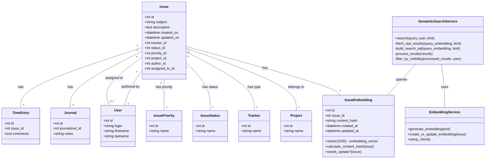

# Semantic Search Domain Model

This Markdown file contains the Mermaid Diagram for the Semantic Search Domain Model. The diagram shows the relationships between Issues, Issue Embeddings, Projects, Users, Trackers and Issue Statuses.

> [!NOTE]
> While Redmine has many other attributes available, only the necessary attributes are shown.

## Model Relationships

- **Issue**: Central entity in Redmine, representing a task, bug, feature, etc.
- **IssueEmbedding**: Stores vector embeddings of issue content for semantic search
- **Project**: Container for issues, representing a project or product
- **User**: Represents system users who can author or be assigned to issues
- **Tracker**: Categorizes issues (e.g., Bug, Feature, Task)
- **IssueStatus**: Represents the current state of an issue (e.g., New, In Progress, Resolved)
- **IssuePriority**: Indicates the priority level of an issue
- **Journal**: Stores updates and comments on issues
- **TimeEntry**: Records time spent on issues with optional comments

## Services

- **EmbeddingService**: Handles generation of vector embeddings via OpenAI API
- **SemanticSearchService**: Performs semantic search using vector similarity
